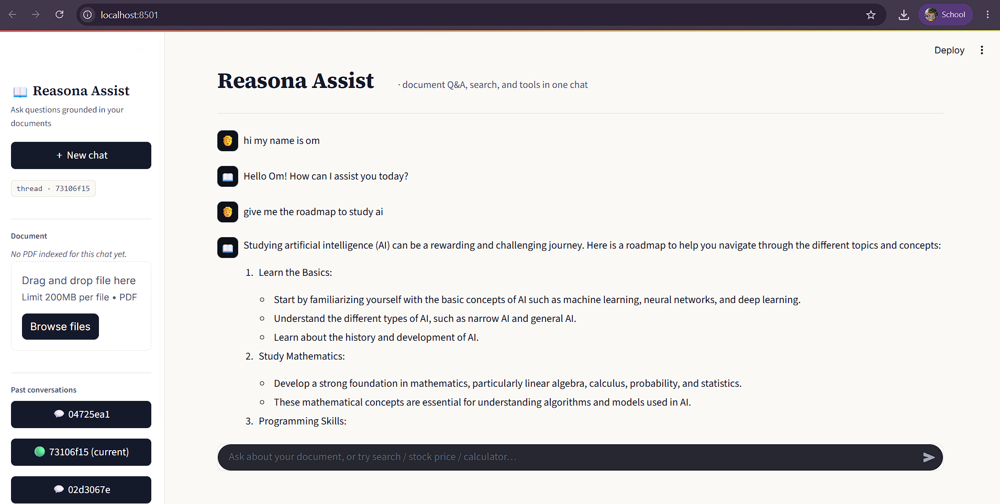
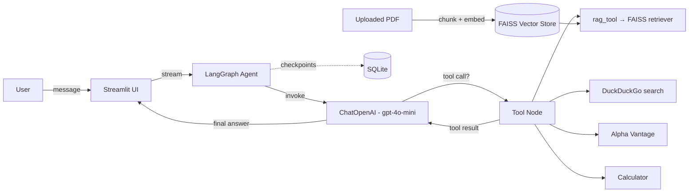

# 📖 Reasona Assist
 
**A document-grounded chatbot built with LangGraph, FAISS, and Streamlit.**
 
Reasona Assist lets you upload a PDF and have a real conversation with it — while
still being able to fall back on live web search, stock prices, or a calculator
whenever the question goes beyond the document. Conversations are persisted per
thread, so you can pick up any past chat exactly where you left off.
 
---
 
## ✨ Features
 
- **Chat with your PDFs** — upload a document per conversation thread; it's chunked,
  embedded, and indexed with FAISS for retrieval-augmented answers.
- **Tool-using agent** — the LLM can autonomously call:
  - `rag_tool` — retrieve relevant chunks from the uploaded PDF
  - `search_tool` — live web search (DuckDuckGo)
  - `get_stock_price` — real-time stock quotes (Alpha Vantage)
  - `calculator` — basic arithmetic
- **Streaming responses** — assistant replies stream token-by-token, with a live
  status indicator whenever a tool is being used.
- **Persistent, multi-thread conversations** — every chat is checkpointed to
  SQLite via LangGraph's `SqliteSaver`, so past conversations survive a restart
  and can be reopened from the sidebar.
- **Clean, purpose-built UI** — a custom Streamlit theme (not the default look)
  with clear visual separation between user and assistant messages, a live
  document status card, and a searchable thread history.
---
 
## 🖼️ Preview
 
| Chat in action |
|---|
|  |
 
> Add your own screenshot at `screenshot.png` — see [Project Structure](#-project-structure).
 
---
 
## 🏗️ Architecture
 

 
The agent is a small **LangGraph** state graph with two nodes:
 
1. `chat_node` — calls the LLM (bound to all four tools) with the running
   message history.
2. `tools` — a `ToolNode` that executes whichever tool the LLM decided to call.
Control flow loops between the two nodes (via `tools_condition`) until the LLM
produces a final answer with no further tool calls.
 
---
 
## 🧰 Tech Stack
 
| Layer | Technology |
|---|---|
| UI | [Streamlit](https://streamlit.io) |
| Orchestration | [LangGraph](https://langchain-ai.github.io/langgraph/) |
| LLM | OpenAI `gpt-4o-mini` via `langchain-openai` |
| Embeddings | OpenAI `text-embedding-3-small` |
| Vector store | [FAISS](https://github.com/facebookresearch/faiss) |
| PDF parsing | `PyPDFLoader` (langchain-community) |
| Persistence | SQLite (`langgraph.checkpoint.sqlite`) |
| Web search | DuckDuckGo (`langchain-community`) |
| Market data | Alpha Vantage API |
 
---
 
## 📁 Project Structure
 
```
reasona-assist/
├── streamlit_rag_frontend.py    # Streamlit UI
├── langgraph_rag_backend.py     # LangGraph agent, tools, retriever, checkpointer
├── .streamlit/
│   └── config.toml              # Forces a consistent light theme
├── docs/
│   └── screenshot.png           # (optional) UI preview used in this README
├── .env                         # API keys (create this yourself — see below)
├── chatbot.db                   # SQLite checkpoint DB (auto-created on first run)
└── requirements.txt
```
 
---
 
## 🚀 Getting Started
 
### 1. Clone and set up a virtual environment
 
```bash
git clone <your-repo-url> reasona-assist
cd reasona-assist
python -m venv venv
source venv/bin/activate        # Windows: venv\Scripts\activate
```
 
### 2. Install dependencies
 
```bash
pip install streamlit langgraph langchain langchain-openai langchain-community \
            faiss-cpu pypdf python-dotenv duckduckgo-search requests
```
 
Or, if you have a `requirements.txt`:
 
```bash
pip install -r requirements.txt
```
 
### 3. Configure environment variables
 
Create a `.env` file in the project root:
 
```env
OPENAI_API_KEY=your_openai_api_key_here
ALPHAVANTAGE_API_KEY=your_alphavantage_api_key_here
```
 
> ⚠️ **Security note:** the current backend has an Alpha Vantage key
> hardcoded directly in `langgraph_rag_backend.py`. Move it into `.env` and
> load it with `os.getenv("ALPHAVANTAGE_API_KEY")` before pushing this
> project anywhere public, and rotate the exposed key.
 
### 4. Run the app
 
```bash
streamlit run streamlit_rag_frontend.py
```
 
The app will be available at **http://localhost:8501**.
 
---
 
## 💬 Usage
 
1. Click **New chat** to start a fresh thread, or select a past conversation
   from the sidebar.
2. Upload a PDF from the sidebar — it's chunked and indexed automatically.
3. Ask questions in the chat box:
   - *"Summarize section 3 of the document"* → uses `rag_tool`
   - *"What's the latest price of TSLA?"* → uses `get_stock_price`
   - *"What's 18% of 240?"* → uses `calculator`
   - *"What's the latest news on X?"* → uses web search
4. Switch between threads anytime — each keeps its own document and full
   message history.
---
 
## 🗺️ Roadmap
 
- [ ] Move all secrets to environment variables (remove hardcoded API key)
- [ ] Support multiple documents per thread
- [ ] Add citation highlighting (show which chunk/page an answer came from)
- [ ] Add authentication for multi-user deployments
- [ ] Dockerize for one-command deployment
---
 
## 🤝 Contributing
 
Issues and pull requests are welcome. If you're proposing a larger change,
please open an issue first to discuss what you'd like to change.
 
---
 
## 📄 License
 
This project is available under the [MIT License](LICENSE).